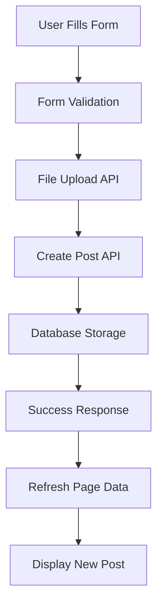

# Affiliates Hub Data Flow & Form Submission Guide

## 🎯 Overview

This document explains how affiliate form submissions are saved to the database and displayed on the affiliates page with real-time updates and visual feedback.

## 🔄 Complete Data Flow

### **1. Form Submission Process**



### **2. API Endpoints Used**

#### **Business Affiliate Submission:**
```
POST /api/v1/affiliates/business-offers
```
**Request Payload:**
```json
{
  "business_name": "Test Business Inc",
  "product_service_title": "Premium Laptop Stand",
  "tagline": "Ergonomic aluminum design",
  "affiliate_category_id": 1,
  "country": "United States",
  "description": "High-quality laptop stand...",
  "commission_type": "percentage",
  "commission_rate": 15.0,
  "cookie_duration": 30,
  "tracking_link": "https://affiliate.techstore.com/track/123",
  "promotional_assets": ["https://cdn.example.com/banner1.jpg"],
  "business_email": "affiliate@techstore.com",
  "website_url": "https://techstore.com"
}
```

#### **User Affiliate Submission:**
```
POST /api/v1/affiliates/user-posts
```
**Request Payload:**
```json
{
  "title": "Best Gaming Laptop Deals",
  "description": "Check out these amazing gaming laptop deals...",
  "affiliate_category_id": 1,
  "country": "United States",
  "affiliate_link": "https://amazon.com/gaming-laptops?tag=user123-20",
  "image": "https://cdn.example.com/laptop-deals.jpg",
  "hashtags": ["gaming", "laptops", "deals"],
  "target_audience": "Gamers and tech enthusiasts"
}
```

### **3. Database Storage**

#### **Business Offers Table:**
```sql
INSERT INTO business_affiliate_offers (
  id,
  business_name,
  product_service_title,
  tagline,
  description,
  affiliate_category_id,
  country,
  commission_type,
  commission_rate,
  cookie_duration,
  tracking_link,
  promotional_assets,
  business_email,
  website_url,
  is_verified,
  status,
  is_promoted,
  is_featured,
  is_sponsored,
  views,
  clicks,
  applications,
  created_at,
  updated_at
) VALUES (...);
```

#### **User Posts Table:**
```sql
INSERT INTO user_affiliate_posts (
  id,
  title,
  description,
  affiliate_category_id,
  country,
  affiliate_link,
  image_url,
  hashtags,
  target_audience,
  status,
  is_promoted,
  is_featured,
  is_sponsored,
  views,
  clicks,
  shares,
  created_at,
  updated_at
) VALUES (...);
```

### **4. Real-time Display Updates**

#### **Data Refresh Flow:**
1. **Form Submission** → API call → Database storage
2. **Success Response** → Frontend receives confirmation
3. **Callback Trigger** → `handleSubmissionSuccess()` called
4. **Data Refresh** → `loadInitialData()` refetches all data
5. **UI Update** → New post appears with "New" badge
6. **Visual Feedback** → Success message + scroll to top

#### **Component Update Chain:**
```javascript
// 1. Form Submission Success
AffiliatePostForm.handleSubmit() 
  ↓ success
// 2. Parent Callback
onSubmissionSuccess(result)
  ↓
// 3. Data Refresh
loadInitialData()
  ↓
// 4. API Calls
affiliateService.getBusinessOffers()
affiliateService.getUserPosts()
  ↓
// 5. State Update
setBusinessOffers(newData)
setUserPosts(newData)
  ↓
// 6. UI Re-render
getAllContent() → AffiliateGrid → New post visible
```

## 🎨 Visual Feedback System

### **1. Success Indicators**

#### **Toast Notifications:**
```javascript
// Success message
toast.success('Business offer created successfully!', {
  duration: 4000,
  position: 'top-center'
});

// After data refresh
toast.success('Affiliate listing created! Refreshing data...', {
  duration: 4000,
  position: 'top-center'
});
```

#### **"New" Badge System:**
```javascript
// Detect new posts (created within last 5 minutes)
const fiveMinutesAgo = new Date(now.getTime() - 5 * 60000);
const isNew = createdAt > fiveMinutesAgo;

// Visual indicator
{offer.isNew && (
  <div className="bg-green-500 text-white text-xs px-2 py-1 rounded-full flex items-center animate-pulse">
    <Badge className="h-3 w-3 mr-1" />
    New
  </div>
)}
```

### **2. Loading States**

#### **Form Submission:**
```javascript
// Loading button
{loading ? (
  <>
    <Loader2 className="h-4 w-4 animate-spin mr-2" />
    Submitting...
  </>
) : (
  'Submit Listing'
)}
```

#### **Data Refresh:**
```javascript
// Page loading indicator
{loading ? (
  <div className="flex justify-center items-center py-12">
    <div className="animate-spin rounded-full h-8 w-8 border-b-2 border-blue-600"></div>
  </div>
) : (
  // Content
)}
```

### **3. Error Handling**

#### **API Error Response:**
```javascript
try {
  await affiliateService.createBusinessOffer(data);
  // Success handling
} catch (err) {
  setError(err.message || 'Failed to submit affiliate listing');
  toast.error(err.message || 'Failed to submit affiliate listing');
}
```

#### **Validation Errors:**
```javascript
// Backend returns 422 with validation errors
{
  "success": false,
  "message": "Validation failed",
  "errors": {
    "business_name": ["The business name field is required."],
    "commission_rate": ["Commission rate must be between 0 and 100."]
  }
}
```

## 📊 Data Display Logic

### **1. Content Transformation**

```javascript
const getAllContent = () => {
  const content = [];
  const now = new Date();
  const fiveMinutesAgo = new Date(now.getTime() - 5 * 60000);
  
  // Transform business offers
  businessOffers.forEach(offer => {
    const createdAt = new Date(offer.created_at);
    const isNew = createdAt > fiveMinutesAgo;
    
    content.push({
      ...offer,
      contentType: 'business',
      id: `business-${offer.id}`,
      type: 'business',
      title: offer.product_service_title || offer.title,
      commission: offer.commission_rate || 0,
      category: offer.affiliate_category?.name || '',
      verified: offer.is_verified || false,
      promoted: offer.is_promoted || false,
      featured: offer.is_featured || false,
      sponsored: offer.is_sponsored || false,
      views: offer.views || 0,
      image: offer.image_url || '/placeholder-image.jpg',
      tracking_link: offer.tracking_link,
      isNew: isNew // New post detection
    });
  });
  
  // Similar transformation for user posts...
  return content;
};
```

### **2. Real-time Updates**

#### **Immediate Display:**
1. **Form Submit** → API → Database
2. **Success Callback** → Refresh data
3. **New Post Detection** → Add `isNew: true` flag
4. **Visual Badge** → Show "New" badge with animation
5. **Auto-Scroll** → Scroll to top to show new content

#### **Badge Duration:**
- **"New" badge** shows for 5 minutes after creation
- **Pulse animation** draws attention to new posts
- **Automatic removal** after timeout period

## 🔍 Click Tracking Integration

### **1. Analytics Tracking**

```javascript
const handleOfferClick = async (offer) => {
  try {
    // Extract clean ID
    const offerType = offer.contentType === 'user' ? 'user' : 'business';
    const offerId = offer.contentType === 'user' 
      ? offer.id.replace('user-', '')
      : offer.id.replace('business-', '');
    
    // Track click analytics
    await trackClick(offerType, parseInt(offerId));
    
    // Open affiliate link
    window.open(offer.tracking_link || offer.affiliate_link, '_blank', 'noopener,noreferrer');
  } catch (error) {
    // Still open link even if tracking fails
    window.open(offer.tracking_link || offer.affiliate_link, '_blank', 'noopener,noreferrer');
  }
};
```

### **2. Database Analytics Update**

```sql
-- Update click tracking
UPDATE affiliate_analytics 
SET clicks = clicks + 1,
  last_clicked_at = NOW()
WHERE content_type = 'business' 
  AND content_id = ?;

-- Insert new click record if not exists
INSERT INTO affiliate_clicks (
  content_type,
  content_id,
  user_id,
  ip_address,
  user_agent,
  clicked_at
) VALUES (...);
```

## 🎯 User Experience Flow

### **1. Submission Journey**

```
User fills form → Clicks submit → Loading state → API call → 
Database storage → Success response → Toast notification → 
Data refresh → New post appears → "New" badge → 
Auto-scroll to top → User sees their post
```

### **2. Success Confirmation**

#### **Multi-layer Feedback:**
1. **Immediate:** Toast notification "Created successfully!"
2. **Secondary:** Toast notification "Refreshing data..."
3. **Visual:** Page refreshes with loading indicator
4. **Final:** New post appears with "New" badge
5. **Positional:** Auto-scroll to top of listings

### **3. Error Recovery**

#### **Graceful Degradation:**
1. **Network Error:** Show error toast, keep form data
2. **Validation Error:** Show field-specific errors
3. **Server Error:** Show error message, offer retry
4. **Partial Success:** Save what we can, report what failed

## 🔧 Technical Implementation Details

### **1. State Management**

```javascript
// Form state
const [formData, setFormData] = useState({
  businessName: '',
  productTitle: '',
  // ... all form fields
});

// Page state
const [businessOffers, setBusinessOffers] = useState([]);
const [userPosts, setUserPosts] = useState([]);
const [loading, setLoading] = useState(true);
```

### **2. API Integration**

```javascript
// Service layer
const affiliateService = {
  createBusinessOffer: async (data) => {
    const response = await api.post('/v1/affiliates/business-offers', data);
    return response.data;
  },
  getBusinessOffers: async (filters) => {
    const params = new URLSearchParams(filters);
    const response = await api.get(`/v1/affiliates/business-offers?${params}`);
    return response.data;
  }
};
```

### **3. Error Boundaries**

```javascript
// Component-level error handling
const AffiliatePostForm = () => {
  const [error, setError] = useState(null);
  
  const handleSubmit = async () => {
    try {
      setLoading(true);
      setError(null);
      // API call...
    } catch (err) {
      setError(err.message);
      toast.error(err.message);
    } finally {
      setLoading(false);
    }
  };
  
  // Error display
  {error && (
    <div className="bg-red-50 border border-red-200 text-red-700 px-4 py-3 rounded-lg">
      {error}
    </div>
  )}
};
```

## ✅ Success Criteria

### **Form Submission Works When:**
- [ ] Data validates correctly on frontend
- [ ] File uploads work with progress indicators
- [ ] API calls complete successfully
- [ ] Database stores all fields correctly
- [ ] Success response returns created item data
- [ ] Error handling works for all failure modes

### **Data Display Works When:**
- [ ] Page refreshes automatically after submission
- [ ] New post appears immediately in listings
- [ ] "New" badge shows on recently created posts
- [ ] Post appears in correct category/filter
- [ ] Pagination updates if needed
- [ ] Scroll position resets to show new content

### **User Experience Confirmed When:**
- [ ] Loading states show during operations
- [ ] Success messages appear at appropriate times
- [ ] Error messages are helpful and specific
- [ ] Visual feedback guides user attention
- [ ] Data persists across page refreshes
- [ ] Mobile experience works correctly

## 🚀 Production Considerations

### **Performance:**
- Implement optimistic updates for better UX
- Cache frequently accessed data
- Use pagination for large datasets
- Optimize image uploads with compression

### **Security:**
- Validate all input data on backend
- Sanitize user-generated content
- Implement rate limiting for submissions
- Use HTTPS for all API calls

### **Scalability:**
- Queue file uploads for processing
- Implement background job processing
- Use CDN for media storage
- Consider database indexing for performance

This complete data flow ensures that when users submit affiliate forms, their data is immediately saved to the database and displayed on the affiliates page with proper visual feedback and real-time updates.
