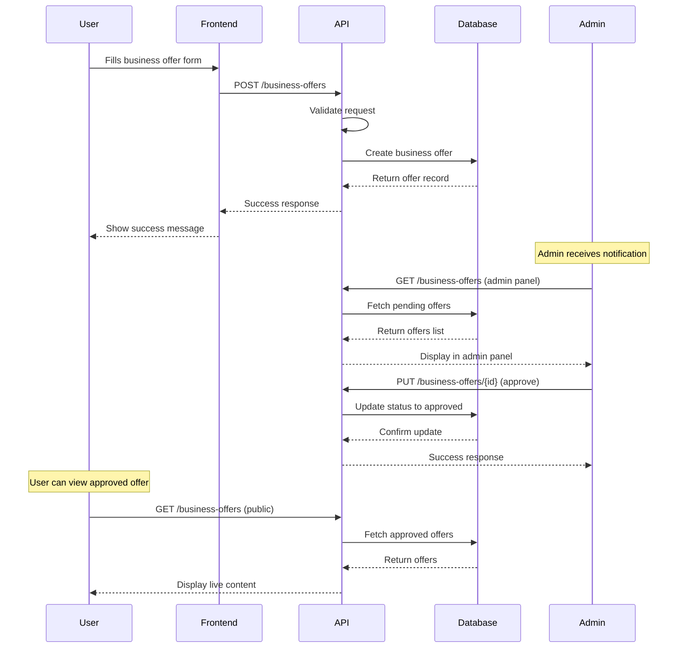
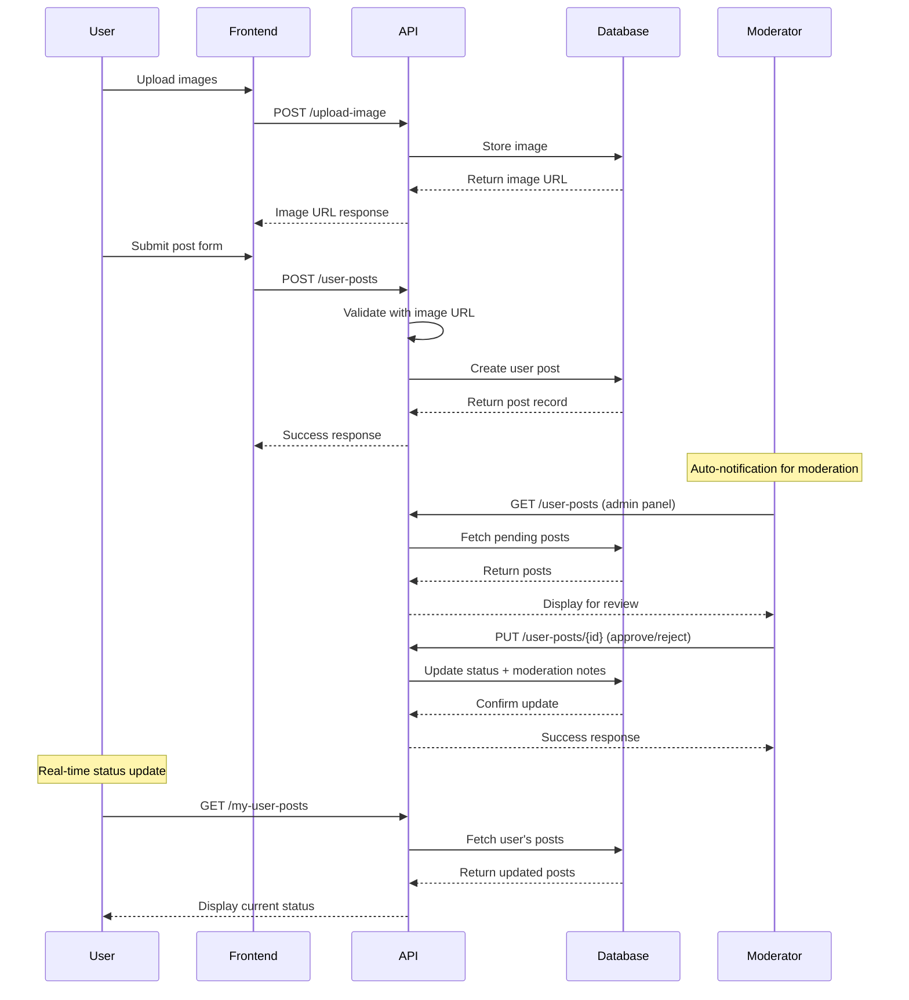
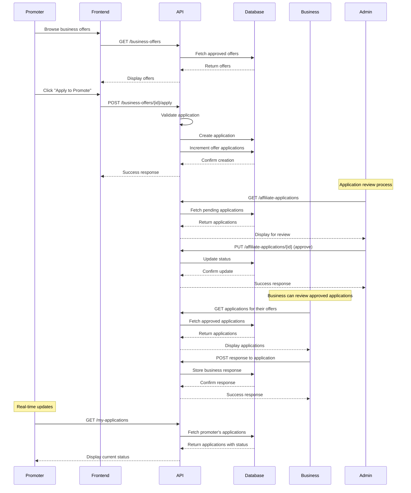
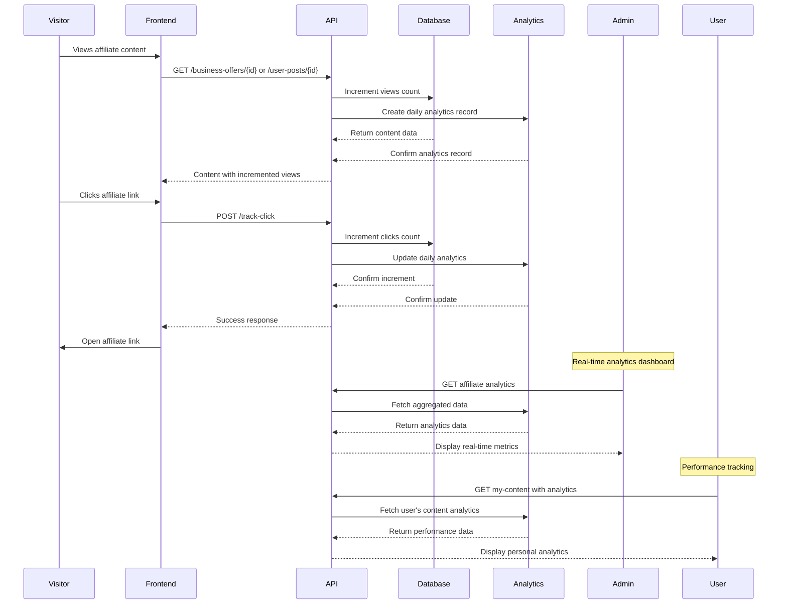

# Affiliates Hub - Complete Backend Implementation Documentation

## 🎯 Overview

This document provides a comprehensive overview of Affiliates Hub backend implementation, including all API endpoints, request/response formats, database structure, and system workflows.

## 🏗️ System Architecture

### **Backend Stack**
- **Framework**: Laravel 11
- **Database**: MySQL with proper relationships and indexes
- **API**: RESTful API with JSON responses
- **Authentication**: Bearer token authentication
- **File Storage**: Local storage with organized directories
- **Analytics**: Real-time tracking and reporting

### **Core Components**
```
Backend Architecture:
├── Controllers/
│   ├── Api/AffiliateController.php     # Main API endpoints
│   └── Api/AffiliateUpsellController.php # Upsell management
├── Models/
│   ├── BusinessAffiliateOffer.php       # Business offer model
│   ├── UserAffiliatePost.php            # User post model
│   ├── AffiliateCategory.php            # Category model
│   ├── AffiliateApplication.php         # Application model
│   ├── AffiliateAnalytics.php          # Analytics model
│   └── AffiliateUpsellPlan.php          # Upsell plans
├── Database/Migrations/                  # Database structure
├── Resources/                           # API resource transformers
└── Seeders/                            # Test data generation
```

## 📊 Database Structure

### **Complete Schema**

#### **1. Affiliate Categories Table**
```sql
CREATE TABLE `affiliate_categories` (
  `id` bigint(20) UNSIGNED NOT NULL AUTO_INCREMENT,
  `name` varchar(255) NOT NULL,
  `slug` varchar(255) NOT NULL,
  `description` text DEFAULT NULL,
  `icon` varchar(255) DEFAULT NULL,
  `is_active` tinyint(1) NOT NULL DEFAULT 1,
  `sort_order` int(11) NOT NULL DEFAULT 0,
  `created_at` timestamp NULL DEFAULT NULL,
  `updated_at` timestamp NULL DEFAULT NULL,
  PRIMARY KEY (`id`),
  UNIQUE KEY `affiliate_categories_slug_unique` (`slug`)
);
```

#### **2. Business Affiliate Offers Table**
```sql
CREATE TABLE `business_affiliate_offers` (
  `id` bigint(20) UNSIGNED NOT NULL AUTO_INCREMENT,
  `user_id` bigint(20) UNSIGNED NOT NULL,
  `affiliate_category_id` bigint(20) UNSIGNED NOT NULL,
  `business_name` varchar(255) NOT NULL,
  `product_service_title` varchar(255) NOT NULL,
  `tagline` varchar(80) DEFAULT NULL,
  `description` text NOT NULL,
  `country` varchar(255) NOT NULL,
  `region` varchar(255) DEFAULT NULL,
  `commission_type` enum('percentage','fixed') NOT NULL,
  `commission_rate` decimal(10,2) NOT NULL,
  `cookie_duration` int(11) NOT NULL,
  `allowed_traffic_types` json DEFAULT NULL,
  `restrictions` text DEFAULT NULL,
  `tracking_link` text NOT NULL,
  `promotional_assets` json DEFAULT NULL,
  `business_email` varchar(255) NOT NULL,
  `website_url` text DEFAULT NULL,
  `verification_document` text DEFAULT NULL,
  `is_verified` tinyint(1) NOT NULL DEFAULT 0,
  `is_promoted` tinyint(1) NOT NULL DEFAULT 0,
  `is_featured` tinyint(1) NOT NULL DEFAULT 0,
  `is_sponsored` tinyint(1) NOT NULL DEFAULT 0,
  `status` enum('pending','approved','rejected') NOT NULL DEFAULT 'pending',
  `views` int(11) NOT NULL DEFAULT 0,
  `clicks` int(11) NOT NULL DEFAULT 0,
  `applications` int(11) NOT NULL DEFAULT 0,
  `payment_status` enum('pending','paid','failed') NOT NULL DEFAULT 'pending',
  `price` decimal(10,2) DEFAULT 0.00,
  `paid_at` timestamp NULL DEFAULT NULL,
  `expires_at` timestamp NULL DEFAULT NULL,
  `is_active` tinyint(1) NOT NULL DEFAULT 1,
  `created_at` timestamp NULL DEFAULT NULL,
  `updated_at` timestamp NULL DEFAULT NULL,
  PRIMARY KEY (`id`),
  KEY `business_affiliate_offers_user_id_foreign` (`user_id`),
  KEY `business_affiliate_offers_affiliate_category_id_foreign` (`affiliate_category_id`),
  CONSTRAINT `business_affiliate_offers_affiliate_category_id_foreign` 
    FOREIGN KEY (`affiliate_category_id`) REFERENCES `affiliate_categories` (`id`),
  CONSTRAINT `business_affiliate_offers_user_id_foreign` 
    FOREIGN KEY (`user_id`) REFERENCES `users` (`id`)
);
```

#### **3. User Affiliate Posts Table**
```sql
CREATE TABLE `user_affiliate_posts` (
  `id` bigint(20) UNSIGNED NOT NULL AUTO_INCREMENT,
  `user_id` bigint(20) UNSIGNED NOT NULL,
  `affiliate_category_id` bigint(20) UNSIGNED NOT NULL,
  `title` varchar(255) NOT NULL,
  `description` text NOT NULL,
  `country` varchar(255) DEFAULT NULL,
  `region` varchar(255) DEFAULT NULL,
  `affiliate_link` text NOT NULL,
  `image` varchar(255) DEFAULT NULL,
  `hashtags` json DEFAULT NULL,
  `target_audience` varchar(255) DEFAULT NULL,
  `is_promoted` tinyint(1) NOT NULL DEFAULT 0,
  `is_featured` tinyint(1) NOT NULL DEFAULT 0,
  `is_sponsored` tinyint(1) NOT NULL DEFAULT 0,
  `status` enum('pending','approved','rejected') NOT NULL DEFAULT 'pending',
  `views` int(11) NOT NULL DEFAULT 0,
  `clicks` int(11) NOT NULL DEFAULT 0,
  `shares` int(11) NOT NULL DEFAULT 0,
  `payment_status` enum('pending','paid','failed') NOT NULL DEFAULT 'pending',
  `price` decimal(10,2) DEFAULT 0.00,
  `paid_at` timestamp NULL DEFAULT NULL,
  `expires_at` timestamp NULL DEFAULT NULL,
  `moderated_by` bigint(20) UNSIGNED DEFAULT NULL,
  `moderated_at` timestamp NULL DEFAULT NULL,
  `moderation_notes` text DEFAULT NULL,
  `is_active` tinyint(1) NOT NULL DEFAULT 1,
  `created_at` timestamp NULL DEFAULT NULL,
  `updated_at` timestamp NULL DEFAULT NULL,
  PRIMARY KEY (`id`),
  KEY `user_affiliate_posts_user_id_foreign` (`user_id`),
  KEY `user_affiliate_posts_affiliate_category_id_foreign` (`affiliate_category_id`),
  KEY `user_affiliate_posts_moderated_by_foreign` (`moderated_by`),
  CONSTRAINT `user_affiliate_posts_affiliate_category_id_foreign` 
    FOREIGN KEY (`affiliate_category_id`) REFERENCES `affiliate_categories` (`id`),
  CONSTRAINT `user_affiliate_posts_moderated_by_foreign` 
    FOREIGN KEY (`moderated_by`) REFERENCES `users` (`id`),
  CONSTRAINT `user_affiliate_posts_user_id_foreign` 
    FOREIGN KEY (`user_id`) REFERENCES `users` (`id`)
);
```

#### **4. Affiliate Applications Table**
```sql
CREATE TABLE `affiliate_applications` (
  `id` bigint(20) UNSIGNED NOT NULL AUTO_INCREMENT,
  `business_affiliate_offer_id` bigint(20) UNSIGNED NOT NULL,
  `user_id` bigint(20) UNSIGNED NOT NULL,
  `message` text DEFAULT NULL,
  `promotion_methods` json DEFAULT NULL,
  `audience_details` json DEFAULT NULL,
  `website_url` text DEFAULT NULL,
  `social_media_links` json DEFAULT NULL,
  `estimated_monthly_visitors` int(11) DEFAULT NULL,
  `status` enum('pending','approved','rejected','withdrawn') NOT NULL DEFAULT 'pending',
  `rejection_reason` text DEFAULT NULL,
  `approval_notes` text DEFAULT NULL,
  `reviewed_by` bigint(20) UNSIGNED DEFAULT NULL,
  `reviewed_at` timestamp NULL DEFAULT NULL,
  `business_response` text DEFAULT NULL,
  `business_responded_at` timestamp NULL DEFAULT NULL,
  `created_at` timestamp NULL DEFAULT NULL,
  `updated_at` timestamp NULL DEFAULT NULL,
  PRIMARY KEY (`id`),
  KEY `affiliate_applications_business_affiliate_offer_id_foreign` (`business_affiliate_offer_id`),
  KEY `affiliate_applications_user_id_foreign` (`user_id`),
  KEY `affiliate_applications_reviewed_by_foreign` (`reviewed_by`),
  CONSTRAINT `affiliate_applications_business_affiliate_offer_id_foreign` 
    FOREIGN KEY (`business_affiliate_offer_id`) REFERENCES `business_affiliate_offers` (`id`),
  CONSTRAINT `affiliate_applications_reviewed_by_foreign` 
    FOREIGN KEY (`reviewed_by`) REFERENCES `users` (`id`),
  CONSTRAINT `affiliate_applications_user_id_foreign` 
    FOREIGN KEY (`user_id`) REFERENCES `users` (`id`)
);
```

#### **5. Affiliate Analytics Table**
```sql
CREATE TABLE `affiliate_analytics` (
  `id` bigint(20) UNSIGNED NOT NULL AUTO_INCREMENT,
  `affiliatable_type` varchar(255) NOT NULL,
  `affiliatable_id` bigint(20) UNSIGNED NOT NULL,
  `date` date NOT NULL,
  `views` int(11) NOT NULL DEFAULT 0,
  `unique_views` int(11) NOT NULL DEFAULT 0,
  `clicks` int(11) NOT NULL DEFAULT 0,
  `unique_clicks` int(11) NOT NULL DEFAULT 0,
  `shares` int(11) NOT NULL DEFAULT 0,
  `applications` int(11) NOT NULL DEFAULT 0,
  `revenue` decimal(10,2) DEFAULT 0.00,
  `created_at` timestamp NULL DEFAULT NULL,
  `updated_at` timestamp NULL DEFAULT NULL,
  PRIMARY KEY (`id`),
  KEY `affiliate_analytics_affiliatable_type_affiliatable_id_index` (`affiliatable_type`,`affiliatable_id`),
  KEY `affiliate_analytics_date_index` (`date`)
);
```

## 🚀 API Endpoints Documentation

### **Base URL**
```
Production: https://your-domain.com/api/v1/affiliates
Development: http://localhost:8000/api/v1/affiliates
```

### **Authentication**
```http
Authorization: Bearer {auth_token}
Content-Type: application/json
```

---

## 📋 Public Endpoints (No Authentication Required)

### **1. Get Categories**
```http
GET /api/v1/affiliates/categories
```

**Response:**
```json
{
  "success": true,
  "data": [
    {
      "id": 1,
      "name": "Technology & Gadgets",
      "slug": "technology-gadgets",
      "description": "Latest technology products, gadgets, electronics, and software affiliate offers.",
      "icon": "heroicon-o-cpu-chip",
      "is_active": true,
      "sort_order": 1,
      "active_business_offers": 15,
      "active_user_posts": 23,
      "created_at": "2024-01-15T10:30:00.000000Z",
      "updated_at": "2024-01-15T10:30:00.000000Z"
    }
  ]
}
```

### **2. Get Business Offers**
```http
GET /api/v1/affiliates/business-offers?category_id=1&country=US&commission_type=percentage&min_commission=5&featured=true&sort=created_at&order=desc&per_page=12
```

**Query Parameters:**
- `category_id` (optional): Filter by category ID
- `country` (optional): Filter by country
- `commission_type` (optional): percentage | fixed
- `min_commission` (optional): Minimum commission rate
- `max_commission` (optional): Maximum commission rate
- `featured` (optional): true | false
- `promoted` (optional): true | false
- `sponsored` (optional): true | false
- `sort` (optional): created_at | views | clicks | commission_rate
- `order` (optional): asc | desc
- `per_page` (optional): Items per page (default: 12)

**Response:**
```json
{
  "success": true,
  "data": {
    "current_page": 1,
    "data": [
      {
        "id": 1,
        "user_id": 123,
        "affiliate_category_id": 1,
        "business_name": "Tech Solutions Inc",
        "product_service_title": "Premium Software Suite",
        "tagline": "Transform your business with cutting-edge software",
        "description": "Comprehensive software solution for modern businesses...",
        "country": "United States",
        "region": "California",
        "commission_type": "percentage",
        "commission_rate": 15.50,
        "cookie_duration": 30,
        "allowed_traffic_types": ["social_media", "email", "ppc"],
        "restrictions": "No incentive traffic allowed",
        "tracking_link": "https://example.com/track/12345",
        "promotional_assets": ["banner1.jpg", "logo.png"],
        "business_email": "affiliate@techsolutions.com",
        "website_url": "https://techsolutions.com",
        "is_verified": true,
        "is_promoted": false,
        "is_featured": true,
        "is_sponsored": false,
        "status": "approved",
        "views": 1250,
        "clicks": 89,
        "applications": 12,
        "display_commission": "15.5%",
        "full_tracking_link": "https://example.com/track/12345",
        "affiliate_category": {
          "id": 1,
          "name": "Technology & Gadgets",
          "slug": "technology-gadgets"
        },
        "user": {
          "id": 123,
          "name": "John Doe",
          "email": "john@example.com"
        },
        "created_at": "2024-01-15T10:30:00.000000Z",
        "updated_at": "2024-01-15T10:30:00.000000Z"
      }
    ],
    "first_page_url": "http://localhost:8000/api/v1/affiliates/business-offers?page=1",
    "from": 1,
    "last_page": 3,
    "last_page_url": "http://localhost:8000/api/v1/affiliates/business-offers?page=3",
    "links": [
      {
        "url": null,
        "label": "&laquo; Previous",
        "active": false
      },
      {
        "url": "http://localhost:8000/api/v1/affiliates/business-offers?page=1",
        "label": "1",
        "active": true
      }
    ],
    "next_page_url": "http://localhost:8000/api/v1/affiliates/business-offers?page=2",
    "path": "http://localhost:8000/api/v1/affiliates/business-offers",
    "per_page": 12,
    "prev_page_url": null,
    "to": 12,
    "total": 35
  }
}
```

### **3. Get Single Business Offer**
```http
GET /api/v1/affiliates/business-offers/{id}
```

**Response:**
```json
{
  "success": true,
  "data": {
    "id": 1,
    "business_name": "Tech Solutions Inc",
    "product_service_title": "Premium Software Suite",
    "description": "Comprehensive software solution...",
    "commission_rate": 15.50,
    "commission_type": "percentage",
    "display_commission": "15.5%",
    "tracking_link": "https://example.com/track/12345",
    "business_email": "affiliate@techsolutions.com",
    "website_url": "https://techsolutions.com",
    "is_verified": true,
    "status": "approved",
    "views": 1251,
    "clicks": 89,
    "applications": 12,
    "affiliate_category": {
      "id": 1,
      "name": "Technology & Gadgets"
    },
    "user": {
      "id": 123,
      "name": "John Doe"
    },
    "analytics": [
      {
        "date": "2024-01-15",
        "views": 45,
        "clicks": 3,
        "applications": 1
      }
    ],
    "created_at": "2024-01-15T10:30:00.000000Z"
  }
}
```

### **4. Get User Posts**
```http
GET /api/v1/affiliates/user-posts?category_id=1&country=US&target_audience=beginners&featured=true&sort=created_at&order=desc&per_page=12
```

**Response:**
```json
{
  "success": true,
  "data": {
    "current_page": 1,
    "data": [
      {
        "id": 1,
        "user_id": 456,
        "affiliate_category_id": 1,
        "title": "My Favorite Tech Gadgets for 2024",
        "description": "Check out these amazing tech gadgets...",
        "country": "United States",
        "affiliate_link": "https://amazon.com/tech-gadgets/ref123",
        "image": "tech-gadgets-cover.jpg",
        "image_url": "https://example.com/storage/affiliate_posts/tech-gadgets-cover.jpg",
        "hashtags": ["tech", "gadgets", "2024", "review"],
        "hashtags_string": "#tech #gadgets #2024 #review",
        "target_audience": "tech enthusiasts",
        "is_promoted": false,
        "is_featured": true,
        "is_sponsored": false,
        "status": "approved",
        "views": 856,
        "clicks": 67,
        "shares": 23,
        "affiliate_category": {
          "id": 1,
          "name": "Technology & Gadgets"
        },
        "user": {
          "id": 456,
          "name": "Jane Smith"
        },
        "created_at": "2024-01-14T15:45:00.000000Z"
      }
    ]
  }
}
```

### **5. Get Single User Post**
```http
GET /api/v1/affiliates/user-posts/{id}
```

### **6. Get Upsell Plans**
```http
GET /api/v1/affiliates/upsell-plans
```

**Response:**
```json
{
  "success": true,
  "data": [
    {
      "id": 1,
      "name": "Promoted Post",
      "slug": "promoted",
      "description": "Get your affiliate post highlighted...",
      "price": 19.99,
      "duration_type": "weekly",
      "duration_days": 7,
      "features": [
        "Highlighted background",
        "Appears above standard posts",
        "2× more visibility",
        "Promoted badge"
      ],
      "badge_text": "Promoted",
      "badge_color": "#3B82F6",
      "is_active": true,
      "sort_order": 1
    },
    {
      "id": 2,
      "name": "Featured Post",
      "slug": "featured",
      "description": "Maximum visibility with top placement...",
      "price": 49.99,
      "duration_type": "monthly",
      "duration_days": 30,
      "features": [
        "Top of category pages",
        "Larger card size",
        "Priority in search results",
        "Featured badge",
        "5× more visibility"
      ],
      "badge_text": "Featured",
      "badge_color": "#10B981",
      "is_active": true,
      "sort_order": 2
    }
  ]
}
```

### **7. Search Affiliate Content**
```http
GET /api/v1/affiliates/search?q=technology&type=all
```

**Query Parameters:**
- `q` (required): Search query (minimum 2 characters)
- `type` (optional): all | business | user

**Response:**
```json
{
  "success": true,
  "data": {
    "business_offers": [
      {
        "id": 1,
        "business_name": "Tech Solutions Inc",
        "product_service_title": "Premium Software Suite",
        "description": "Comprehensive software solution...",
        "commission_rate": 15.50,
        "display_commission": "15.5%",
        "affiliate_category": {
          "name": "Technology & Gadgets"
        },
        "user": {
          "name": "John Doe"
        }
      }
    ],
    "user_posts": [
      {
        "id": 1,
        "title": "My Favorite Tech Gadgets for 2024",
        "description": "Check out these amazing tech gadgets...",
        "affiliate_category": {
          "name": "Technology & Gadgets"
        },
        "user": {
          "name": "Jane Smith"
        }
      }
    ]
  }
}
```

### **8. Track Click**
```http
POST /api/v1/affiliates/track-click
```

**Request Body:**
```json
{
  "type": "business",
  "id": 1
}
```

**Response:**
```json
{
  "success": true,
  "message": "Click tracked successfully"
}
```

---

## 🔐 Authenticated Endpoints (Bearer Token Required)

### **1. Upload Image**
```http
POST /api/v1/affiliates/upload-image
Authorization: Bearer {auth_token}
Content-Type: multipart/form-data
```

**Request Body:**
```
file: [image_file]
```

**Response:**
```json
{
  "success": true,
  "message": "Image uploaded successfully",
  "data": {
    "url": "https://example.com/storage/affiliate_images/image123.jpg",
    "id": "img_123456",
    "filename": "image123.jpg"
  }
}
```

### **2. Create Business Offer**
```http
POST /api/v1/affiliates/business-offers
Authorization: Bearer {auth_token}
Content-Type: application/json
```

**Request Body:**
```json
{
  "business_name": "Tech Solutions Inc",
  "product_service_title": "Premium Software Suite",
  "tagline": "Transform your business with cutting-edge software",
  "description": "Comprehensive software solution for modern businesses including CRM, project management, and analytics tools.",
  "affiliate_category_id": 1,
  "country": "United States",
  "region": "California",
  "commission_type": "percentage",
  "commission_rate": 15.5,
  "cookie_duration": 30,
  "allowed_traffic_types": ["social_media", "email", "ppc"],
  "restrictions": "No incentive traffic allowed",
  "tracking_link": "https://example.com/track/12345",
  "promotional_assets": ["banner1.jpg", "logo.png"],
  "business_email": "affiliate@techsolutions.com",
  "website_url": "https://techsolutions.com"
}
```

**Response:**
```json
{
  "success": true,
  "message": "Business affiliate offer created successfully",
  "data": {
    "id": 123,
    "business_name": "Tech Solutions Inc",
    "product_service_title": "Premium Software Suite",
    "status": "pending",
    "is_verified": false,
    "views": 0,
    "clicks": 0,
    "applications": 0,
    "affiliate_category": {
      "id": 1,
      "name": "Technology & Gadgets"
    },
    "created_at": "2024-01-15T10:30:00.000000Z"
  }
}
```

### **3. Update Business Offer**
```http
PUT /api/v1/affiliates/business-offers/{id}
Authorization: Bearer {auth_token}
Content-Type: application/json
```

**Request Body:**
```json
{
  "business_name": "Tech Solutions Inc Updated",
  "commission_rate": 20.0,
  "tagline": "Updated tagline for better conversion"
}
```

**Response:**
```json
{
  "success": true,
  "message": "Business affiliate offer updated successfully",
  "data": {
    "id": 123,
    "business_name": "Tech Solutions Inc Updated",
    "commission_rate": 20.0,
    "display_commission": "20.0%",
    "updated_at": "2024-01-15T11:00:00.000000Z"
  }
}
```

### **4. Delete Business Offer**
```http
DELETE /api/v1/affiliates/business-offers/{id}
Authorization: Bearer {auth_token}
```

**Response:**
```json
{
  "success": true,
  "message": "Business affiliate offer deleted successfully"
}
```

### **5. Create User Post**
```http
POST /api/v1/affiliates/user-posts
Authorization: Bearer {auth_token}
Content-Type: application/json
```

**Request Body:**
```json
{
  "title": "My Favorite Tech Gadgets for 2024",
  "description": "Check out these amazing tech gadgets that I've been using and loving this year. From smart home devices to portable chargers, these are must-haves!",
  "affiliate_category_id": 1,
  "country": "United States",
  "affiliate_link": "https://amazon.com/tech-gadgets/ref123",
  "image": "tech-gadgets-cover.jpg",
  "hashtags": ["tech", "gadgets", "2024", "review"],
  "target_audience": "tech enthusiasts, early adopters"
}
```

**Response:**
```json
{
  "success": true,
  "message": "User affiliate post created successfully",
  "data": {
    "id": 456,
    "title": "My Favorite Tech Gadgets for 2024",
    "status": "pending",
    "views": 0,
    "clicks": 0,
    "shares": 0,
    "affiliate_category": {
      "id": 1,
      "name": "Technology & Gadgets"
    },
    "created_at": "2024-01-15T10:30:00.000000Z"
  }
}
```

### **6. Update User Post**
```http
PUT /api/v1/affiliates/user-posts/{id}
Authorization: Bearer {auth_token}
Content-Type: application/json
```

### **7. Delete User Post**
```http
DELETE /api/v1/affiliates/user-posts/{id}
Authorization: Bearer {auth_token}
```

### **8. Apply to Promote Offer**
```http
POST /api/v1/affiliates/business-offers/{offerId}/apply
Authorization: Bearer {auth_token}
Content-Type: application/json
```

**Request Body:**
```json
{
  "message": "I'm interested in promoting your tech products. I have a tech blog with 10k monthly visitors.",
  "promotion_methods": ["blogging", "social_media"],
  "audience_details": {
    "age_range": "25-45",
    "interests": ["technology", "gadgets", "software"],
    "geography": "North America"
  },
  "website_url": "https://mytechblog.com",
  "social_media_links": ["https://twitter.com/techblogger", "https://instagram.com/techreviews"],
  "estimated_monthly_visitors": 10000
}
```

**Response:**
```json
{
  "success": true,
  "message": "Application submitted successfully",
  "data": {
    "id": 789,
    "business_affiliate_offer_id": 123,
    "user_id": 456,
    "status": "pending",
    "message": "I'm interested in promoting your tech products...",
    "estimated_monthly_visitors": 10000,
    "created_at": "2024-01-15T10:30:00.000000Z"
  }
}
```

### **9. Get My Applications**
```http
GET /api/v1/affiliates/my-applications?per_page=10
Authorization: Bearer {auth_token}
```

**Response:**
```json
{
  "success": true,
  "data": {
    "current_page": 1,
    "data": [
      {
        "id": 789,
        "business_affiliate_offer_id": 123,
        "user_id": 456,
        "status": "pending",
        "message": "I'm interested in promoting your tech products...",
        "estimated_monthly_visitors": 10000,
        "business_affiliate_offer": {
          "id": 123,
          "product_service_title": "Premium Software Suite",
          "business_name": "Tech Solutions Inc",
          "commission_rate": 15.50,
          "display_commission": "15.5%"
        },
        "created_at": "2024-01-15T10:30:00.000000Z"
      }
    ]
  }
}
```

### **10. Get My Business Offers**
```http
GET /api/v1/affiliates/my-business-offers?per_page=10
Authorization: Bearer {auth_token}
```

### **11. Get My User Posts**
```http
GET /api/v1/affiliates/my-user-posts?per_page=10
Authorization: Bearer {auth_token}
```

---

## 🔄 System Workflows

### **1. Business Offer Creation Workflow**



### **2. User Post Creation & Moderation Workflow**



### **3. Application Process Workflow**



### **4. Analytics Tracking Workflow**



---

## 🎯 Model Relationships & Methods

### **BusinessAffiliateOffer Model**

#### **Relationships**
```php
// User who created offer
public function user(): BelongsTo
{
    return $this->belongsTo(User::class);
}

// Category of offer
public function affiliateCategory(): BelongsTo
{
    return $this->belongsTo(AffiliateCategory::class);
}

// Applications to promote this offer
public function applications(): HasMany
{
    return $this->hasMany(AffiliateApplication::class);
}

// Analytics data
public function analytics(): MorphMany
{
    return $this->morphMany(AffiliateAnalytics::class, 'affiliatable');
}

// Upsell purchases
public function upsells(): MorphMany
{
    return $this->morphMany(AffiliatePostUpsell::class, 'affiliatable');
}
```

#### **Scopes**
```php
// Only active, approved, non-expired offers
public function scopeActive($query)
{
    return $query->where('is_active', true)
                ->where('status', 'approved')
                ->where(function ($q) {
                    $q->whereNull('expires_at')
                      ->orWhere('expires_at', '>', now());
                });
}

// Only verified offers
public function scopeVerified($query)
{
    return $query->where('is_verified', true);
}

// Promotion visibility scopes
public function scopePromoted($query)
{
    return $query->where('is_promoted', true);
}

public function scopeFeatured($query)
{
    return $query->where('is_featured', true);
}

public function scopeSponsored($query)
{
    return $query->where('is_sponsored', true);
}
```

#### **Methods**
```php
// Check if offer is currently active
public function isCurrentlyActive(): bool
{
    if (!$this->is_active || $this->status !== 'approved') {
        return false;
    }
    if ($this->expires_at && now()->gt($this->expires_at)) {
        return false;
    }
    return true;
}

// Format commission for display
public function getDisplayCommissionAttribute(): string
{
    return $this->commission_type === 'percentage' 
        ? $this->commission_rate . '%'
        : '$' . number_format($this->commission_rate, 2);
}

// Increment views with analytics
public function incrementViews(): void
{
    $this->increment('views');
    $this->analytics()->create([
        'date' => now()->toDateString(),
        'views' => 1,
        'unique_views' => 1,
    ]);
}

// Increment clicks with analytics
public function incrementClicks(): void
{
    $this->increment('clicks');
    $this->analytics()->create([
        'date' => now()->toDateString(),
        'clicks' => 1,
        'unique_clicks' => 1,
    ]);
}
```

### **UserAffiliatePost Model**

#### **Relationships**
```php
// User who created post
public function user(): BelongsTo
{
    return $this->belongsTo(User::class);
}

// Category of post
public function affiliateCategory(): BelongsTo
{
    return $this->belongsTo(AffiliateCategory::class);
}

// Admin who moderated post
public function moderator(): BelongsTo
{
    return $this->belongsTo(User::class, 'moderated_by');
}

// Analytics data
public function analytics(): MorphMany
{
    return $this->morphMany(AffiliateAnalytics::class, 'affiliatable');
}

// Upsell purchases
public function upsells(): MorphMany
{
    return $this->morphMany(AffiliatePostUpsell::class, 'affiliatable');
}
```

#### **Methods**
```php
// Format hashtags for display
public function getHashtagsStringAttribute(): string
{
    if (!$this->hashtags) {
        return '';
    }
    return '#' . implode(' #', $this->hashtags);
}

// Set hashtags from string input
public function setHashtagsFromStringAttribute(string $value): void
{
    $hashtags = array_filter(array_map('trim', explode('#', $value)));
    $this->hashtags = $hashtags;
}

// Get image URL
public function getImageUrlAttribute(): ?string
{
    if (!$this->image) {
        return null;
    }
    $fileUpload = new FileUploadHelper();
    return $fileUpload->getFile($this->image, 'affiliate_posts');
}

// Approve post with moderation
public function approve(?int $moderatorId = null, ?string $notes = null): void
{
    $this->update([
        'status' => 'approved',
        'moderated_by' => $moderatorId,
        'moderated_at' => now(),
        'moderation_notes' => $notes,
    ]);
}

// Reject post with reason
public function reject(?int $moderatorId = null, ?string $reason = null): void
{
    $this->update([
        'status' => 'rejected',
        'moderated_by' => $moderatorId,
        'moderated_at' => now(),
        'moderation_notes' => $reason,
    ]);
}
```

---

## 🔍 Validation Rules

### **Business Offer Validation**
```php
$validator = Validator::make($request->all(), [
    'business_name' => 'required|string|max:255',
    'product_service_title' => 'required|string|max:255',
    'tagline' => 'nullable|string|max:80',
    'description' => 'required|string',
    'affiliate_category_id' => 'required|exists:affiliate_categories,id',
    'country' => 'required|string|max:255',
    'region' => 'nullable|string|max:255',
    'commission_type' => 'required|in:percentage,fixed',
    'commission_rate' => 'required|numeric|min:0',
    'cookie_duration' => 'required|integer|min:1',
    'allowed_traffic_types' => 'nullable|array',
    'allowed_traffic_types.*' => 'in:social_media,email,ppc,blogging,influencer,other',
    'restrictions' => 'nullable|string',
    'tracking_link' => 'required|url',
    'promotional_assets' => 'nullable|array',
    'business_email' => 'required|email',
    'website_url' => 'nullable|url',
    'verification_document' => 'nullable|string',
]);
```

### **User Post Validation**
```php
$validator = Validator::make($request->all(), [
    'title' => 'required|string|max:255',
    'description' => 'required|string',
    'affiliate_category_id' => 'required|exists:affiliate_categories,id',
    'country' => 'nullable|string|max:255',
    'region' => 'nullable|string|max:255',
    'affiliate_link' => 'required|url',
    'image' => 'required|string',
    'hashtags' => 'nullable|array',
    'hashtags.*' => 'string|max:50',
    'target_audience' => 'nullable|string|max:255',
]);
```

### **Application Validation**
```php
$validator = Validator::make($request->all(), [
    'message' => 'nullable|string',
    'promotion_methods' => 'nullable|array',
    'promotion_methods.*' => 'string',
    'audience_details' => 'nullable|array',
    'website_url' => 'nullable|url',
    'social_media_links' => 'nullable|array',
    'estimated_monthly_visitors' => 'nullable|integer|min:0',
]);
```

---

## 📊 Error Handling

### **Standard Error Response Format**
```json
{
  "success": false,
  "message": "Error description",
  "errors": {
    "field_name": [
      "Specific validation error message"
    ]
  }
}
```

### **Common Error Responses**

#### **Validation Errors (422)**
```json
{
  "success": false,
  "message": "Validation failed",
  "errors": {
    "business_name": [
      "The business name field is required."
    ],
    "commission_rate": [
      "The commission rate must be at least 0."
    ]
  }
}
```

#### **Authentication Errors (401)**
```json
{
  "success": false,
  "message": "Unauthenticated.",
  "errors": {
    "auth": [
      "Invalid or expired authentication token."
    ]
  }
}
```

#### **Not Found Errors (404)**
```json
{
  "success": false,
  "message": "Resource not found.",
  "errors": {
    "resource": [
      "The requested business offer could not be found."
    ]
  }
}
```

#### **Authorization Errors (403)**
```json
{
  "success": false,
  "message": "Access denied.",
  "errors": {
    "authorization": [
      "You do not have permission to perform this action."
    ]
  }
}
```

---

## 🚀 Performance Optimization

### **Database Indexes**
```sql
-- Performance indexes
CREATE INDEX idx_business_offers_active ON business_affiliate_offers(is_active, status, expires_at);
CREATE INDEX idx_user_posts_active ON user_affiliate_posts(is_active, status, expires_at);
CREATE INDEX idx_affiliate_analytics_date ON affiliate_analytics(date);
CREATE INDEX idx_affiliate_analytics_morph ON affiliate_analytics(affiliatable_type, affiliatable_id);

-- Search indexes
CREATE INDEX idx_business_offers_search ON business_affiliate_offers(business_name, product_service_title);
CREATE INDEX idx_user_posts_search ON user_affiliate_posts(title, description);
```

### **Caching Strategy**
```php
// Cache categories (rarely changes)
$categories = Cache::remember('affiliate_categories', 3600, function () {
    return AffiliateCategory::active()->ordered()->get();
});

// Cache active offers (5 minutes)
$offers = Cache::remember('active_business_offers_' . md5(serialize($filters)), 300, function () use ($filters) {
    return BusinessAffiliateOffer::active()->filter($filters)->get();
});
```

### **Query Optimization**
```php
// Eager loading to prevent N+1 queries
$offers = BusinessAffiliateOffer::with(['user', 'affiliateCategory'])
    ->active()
    ->paginate(12);

// Selective columns for better performance
$posts = UserAffiliatePost::select(['id', 'title', 'description', 'image', 'created_at'])
    ->with(['affiliateCategory:id,name'])
    ->active()
    ->paginate(12);
```

---

## 📈 Analytics Implementation

### **Real-time Tracking**
```php
// Automatic view tracking
public function showBusinessOffer($id)
{
    $offer = BusinessAffiliateOffer::with(['user', 'affiliateCategory', 'analytics'])
        ->findOrFail($id);
    
    // Increment views asynchronously
    dispatch(function () use ($offer) {
        $offer->incrementViews();
    })->afterResponse();
    
    return response()->json([
        'success' => true,
        'data' => $offer,
    ]);
}

// Click tracking endpoint
public function trackClick(Request $request)
{
    $validated = $request->validate([
        'type' => 'required|in:business,user',
        'id' => 'required|integer',
    ]);
    
    $model = $validated['type'] === 'business' 
        ? BusinessAffiliateOffer::class 
        : UserAffiliatePost::class;
    
    $content = $model::find($validated['id']);
    if ($content) {
        $content->incrementClicks();
    }
    
    return response()->json([
        'success' => true,
        'message' => 'Click tracked successfully',
    ]);
}
```

### **Analytics Aggregation**
```php
// Daily analytics aggregation
public function generateDailyAnalytics()
{
    $today = now()->toDateString();
    
    // Aggregate business offers
    BusinessAffiliateOffer::whereDate('created_at', $today)
        ->selectRaw('COUNT(*) as total, SUM(views) as total_views, SUM(clicks) as total_clicks')
        ->first()
        ->each(function ($stats) use ($today) {
            AffiliateAnalytics::updateOrCreate([
                'affiliatable_type' => BusinessAffiliateOffer::class,
                'affiliatable_id' => $stats->id,
                'date' => $today,
            ], [
                'views' => $stats->total_views,
                'clicks' => $stats->total_clicks,
            ]);
        });
}
```

---

## 🔄 API Rate Limiting

### **Rate Limiting Configuration**
```php
// API rate limiting
Route::middleware('throttle:60,1')->group(function () {
    // Public endpoints: 60 requests per minute
    Route::get('/categories', [ApiAffiliateController::class, 'categories']);
    Route::get('/business-offers', [ApiAffiliateController::class, 'businessOffers']);
    Route::get('/user-posts', [ApiAffiliateController::class, 'userPosts']);
});

Route::middleware('throttle:30,1')->group(function () {
    // Authenticated endpoints: 30 requests per minute
    Route::post('/business-offers', [ApiAffiliateController::class, 'createBusinessOffer']);
    Route::post('/user-posts', [ApiAffiliateController::class, 'createUserPost']);
    Route::post('/upload-image', [ApiAffiliateController::class, 'uploadImage']);
});
```

---

## 🎯 Complete System Summary

### **Backend Capabilities**
1. **Complete CRUD Operations**: Full create, read, update, delete for all affiliate content
2. **Advanced Filtering**: Search, filter, and sort capabilities
3. **File Upload System**: Image upload with proper storage and validation
4. **Analytics Tracking**: Real-time views, clicks, and engagement metrics
5. **Application System**: Complete workflow for affiliate applications
6. **Content Moderation**: Admin approval workflows with audit trails
7. **Upsell Management**: Promotion tier system with payment integration
8. **Performance Optimization**: Caching, indexing, and query optimization

### **API Features**
- **RESTful Design**: Proper HTTP methods and status codes
- **Comprehensive Validation**: Input validation with detailed error messages
- **Authentication**: Secure bearer token authentication
- **Pagination**: Efficient data pagination for large datasets
- **Real-time Updates**: Live analytics and status tracking
- **Error Handling**: Consistent error response format
- **Rate Limiting**: Protection against API abuse

### **Database Design**
- **Normalized Structure**: Proper relationships and constraints
- **Performance Indexes**: Optimized for common queries
- **Analytics Storage**: Efficient tracking and aggregation
- **Data Integrity**: Foreign keys and validation constraints
- **Scalability**: Designed for high-volume traffic

### **Security Features**
- **Input Validation**: Comprehensive request validation
- **Authentication**: Secure token-based authentication
- **Authorization**: Role-based access control
- **SQL Injection Prevention**: Parameterized queries
- **XSS Protection**: Output escaping and sanitization
- **CSRF Protection**: Token verification for state-changing requests

This complete backend implementation provides a robust, scalable, and feature-rich affiliate management system that can handle enterprise-level traffic while maintaining excellent performance and security standards.
