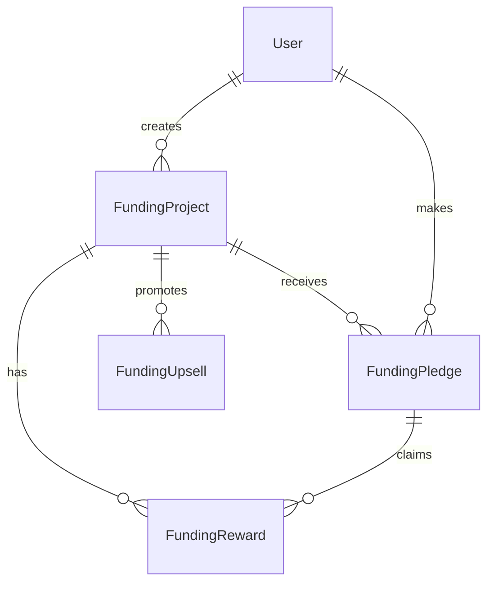
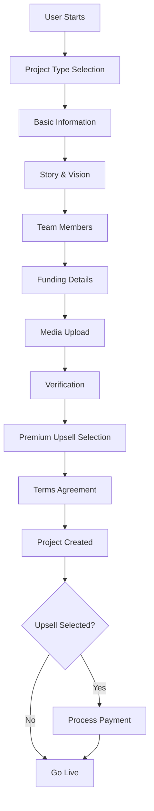

# Funding System - Complete Implementation Guide

## Overview

The WorldwideAdverts Funding System is a comprehensive crowdfunding platform that enables project creators to raise funds from global supporters while providing premium promotion options for enhanced visibility.

## 🏗️ System Architecture

### Core Components

1. **Funding Projects** - Main crowdfunding campaigns
2. **Funding Rewards** - Tier-based reward system
3. **Funding Pledges** - Financial contributions
4. **Funding Upsells** - Premium promotion packages
5. **Admin Management** - Complete backend control

### Database Schema



## 📊 System Mechanism

### 1. Project Creation Flow



### 2. Funding Models Supported

| Model | Description | Use Case |
|-------|-------------|----------|
| **Donation** | Pure donations without rewards | Charity, social causes |
| **Reward-Based** | Contributors receive perks | Creative projects, products |
| **Equity** | Investors receive shares (future) | Startups, businesses |
| **Loan-Based** | Peer-to-peer lending (future) | Business expansion |
| **Hybrid** | Combination of models | Complex projects |

### 3. Premium Upsell System

#### Tier Structure

1. **Promoted Project** - $29.99
   - Highlighted card design
   - Above standard listings
   - "Promoted" badge
   - 2× more visibility

2. **Featured Project** - $59.99 ⭐ Most Popular
   - Top of category pages
   - Larger card design
   - Priority in search results
   - Weekly "Top Projects" email
   - "Featured" badge

3. **Sponsored Project** - $99.99
   - Homepage placement
   - Category top placement
   - Homepage slider inclusion
   - Social media promotion
   - "Sponsored" badge
   - Maximum visibility

### 4. Verification & Trust System

#### Identity Verification
- ID document upload
- Business registration verification
- Manual admin review process
- Trust badges for verified projects

#### Content Moderation
- Automated content scanning
- Manual review workflows
- Harmful content detection
- Community reporting system

## 🔧 Technical Implementation

### Backend Models

#### FundingProject Model
```php
class FundingProject extends Model
{
    protected $fillable = [
        'user_id', 'title', 'tagline', 'project_type', 'category',
        'description', 'problem_solving', 'vision_mission', 'why_now',
        'team_members', 'funding_goal', 'currency', 'minimum_contribution',
        'funding_model', 'use_of_funds', 'milestones', 'cover_image',
        'additional_images', 'country', 'city', 'website', 'social_links',
        'pitch_video', 'documents', 'identity_verification',
        'business_registration_number', 'is_verified', 'is_active',
        'is_featured', 'is_promoted', 'is_sponsored', 'amount_raised',
        'backer_count', 'views_count', 'shares_count',
        'funding_starts_at', 'funding_ends_at'
    ];

    protected $casts = [
        'team_members' => 'array',
        'use_of_funds' => 'array',
        'milestones' => 'array',
        'social_links' => 'array',
        'documents' => 'array',
        'additional_images' => 'array',
        'is_verified' => 'boolean',
        'is_active' => 'boolean',
        'is_featured' => 'boolean',
        'is_promoted' => 'boolean',
        'is_sponsored' => 'boolean',
        'funding_goal' => 'decimal:2',
        'amount_raised' => 'decimal:2',
        'funding_starts_at' => 'datetime',
        'funding_ends_at' => 'datetime',
    ];
}
```

#### Key Methods
```php
// Funding percentage calculation
public function getFundingPercentageAttribute(): float
{
    if ($this->funding_goal == 0) return 0;
    return round(($this->amount_raised / $this->funding_goal) * 100, 2);
}

// Check if project is fully funded
public function isFunded(): bool
{
    return $this->amount_raised >= $this->funding_goal;
}

// Days remaining in campaign
public function getDaysRemainingAttribute(): ?int
{
    if (!$this->funding_ends_at) return null;
    $days = now()->diffInDays($this->funding_ends_at, false);
    return max(0, (int)$days);
}
```

### API Endpoints

#### Project Management
```
GET    /api/v1/funding                    # List all projects
GET    /api/v1/funding/metadata           # Get form metadata
GET    /api/v1/funding/featured          # Featured projects
GET    /api/v1/funding/trending           # Trending projects
GET    /api/v1/funding/ending-soon       # Projects ending soon
GET    /api/v1/funding/{id}              # Project details
POST   /api/v1/funding                    # Create project (auth)
PUT    /api/v1/funding/{id}              # Update project (auth)
DELETE /api/v1/funding/{id}              # Delete project (auth)
GET    /api/v1/funding/my-projects/list   # My projects (auth)
```

#### Pledge Management
```
POST   /api/v1/funding-pledges/{projectId}    # Make pledge (auth)
GET    /api/v1/funding-pledges/{pledgeId}    # Pledge details (auth)
GET    /api/v1/funding-pledges/my/pledges     # My pledges (auth)
PUT    /api/v1/funding-pledges/{pledgeId}/status # Update status (auth)
DELETE /api/v1/funding-pledges/{pledgeId}    # Cancel pledge (auth)
GET    /api/v1/funding-pledges/project/{projectId}/backers # Project backers
```

#### Upsell Management
```
GET    /api/v1/funding-upsells/plans         # Available plans
GET    /api/v1/funding-upsells/comparison    # Plan comparison
GET    /api/v1/funding-upsells/recommendation # Get recommendation
POST   /api/v1/funding-upsells/purchase       # Purchase upsell (auth)
GET    /api/v1/funding-upsells/my-upsells     # My upsells (auth)
GET    /api/v1/funding-upsells/post/{projectId} # Project upsells
POST   /api/v1/funding-upsells/{id}/cancel     # Cancel upsell (auth)
GET    /api/v1/funding-upsells/stats          # Upsell statistics
```

### Frontend Form Structure

#### 9-Step Progressive Form

1. **Project Type Selection**
   - Project type selection (Personal, Startup, Community, Creative)
   - Visual icons and descriptions
   - Examples for each type

2. **Basic Project Information**
   - Title and tagline with character limits
   - Category selection with icons
   - Location information (country, city)
   - Cover image upload (required)
   - Additional images (up to 5)

3. **Project Story & Vision**
   - Rich text descriptions
   - Problem statement
   - Vision and mission
   - Why it matters now
   - Team member management (dynamic)

4. **Funding Details**
   - Financial goals and currency
   - Minimum contribution amount
   - Funding model selection
   - Use of funds breakdown (dynamic)
   - Timeline and milestones (dynamic)

5. **Rewards Section** (Conditional)
   - Only shown for reward-based funding
   - Multiple reward tiers
   - Contribution amounts
   - Delivery estimates
   - Quantity limits

6. **Verification & Trust**
   - Identity verification upload
   - Business registration number
   - Website and social links
   - Trust building features

7. **Marketing Assets**
   - Pitch video URL
   - Supporting documents upload
   - Portfolio materials
   - Business plans

8. **Premium Upsell Options**
   - 4-tier upsell selection
   - Visual comparison table
   - Success metrics
   - Payment processing

9. **Final Submission**
   - Terms and conditions
   - Accuracy confirmation
   - Project summary
   - Submit button

### Admin Panel Features

#### Resource Management
- **FundingProjectResource** - Complete CRUD with advanced filtering
- **FundingRewardResource** - Reward tier management
- **FundingPledgeResource** - Pledge tracking and verification
- **FundingUpsellResource** - Premium promotion management

#### Dashboard Widgets
- **FundingOverviewWidget** - Real-time statistics
- **FundingChartWidget** - Project creation trends
- **RecentFundingProjectsWidget** - Latest projects table

#### Advanced Features
- Bulk actions (mark verified, mark featured)
- Advanced filtering and search
- Export capabilities
- Analytics and reporting

## 🚀 Deployment & Configuration

### Environment Variables
```env
# File Upload Configuration
FILESYSTEM_DISK=public

# Funding Configuration
FUNDING_MAX_FILE_SIZE=5120
FUNDING_ALLOWED_IMAGES=jpeg,png,jpg,gif
FUNDING_ALLOWED_DOCS=pdf,doc,docx,xls,xlsx,ppt,pptx

# Upsell Pricing
FUNDING_PROMOTED_PRICE=29.99
FUNDING_FEATURED_PRICE=59.99
FUNDING_SPONSORED_PRICE=99.99
```

### Storage Directories
```
storage/app/public/
├── funding/
│   ├── covers/          # Project cover images
│   ├── additional/      # Additional images
│   ├── documents/       # Supporting documents
│   ├── verification/    # ID verification docs
│   ├── business/        # Business registration
│   └── team/           # Team member photos
```

## 🔒 Security & Validation

### Input Validation
- Comprehensive form validation rules
- File type and size restrictions
- SQL injection prevention
- XSS protection

### User Permissions
- Project ownership verification
- Admin role-based access control
- API rate limiting
- Authentication middleware

### Data Protection
- Secure file storage
- Sensitive data encryption
- GDPR compliance features
- User privacy controls

## 📈 Analytics & Reporting

### Key Metrics
- Project creation trends
- Funding success rates
- Popular categories
- Geographic distribution
- Upsell conversion rates

### Admin Dashboard
- Real-time statistics
- Revenue tracking
- User engagement metrics
- Performance indicators

## 🔄 API Response Formats

### Success Response
```json
{
    "success": true,
    "message": "Project created successfully",
    "data": {
        "id": 1,
        "title": "Amazing Project",
        "funding_goal": 10000.00,
        "amount_raised": 2500.00,
        "funding_percentage": 25.0,
        "backer_count": 15,
        "created_at": "2024-01-15T10:30:00Z"
    }
}
```

### Error Response
```json
{
    "success": false,
    "errors": {
        "title": ["The title field is required."],
        "funding_goal": ["The funding goal must be at least 1."]
    }
}
```

## 🎯 Best Practices

### For Project Creators
1. **Compelling Story** - Clear problem statement and vision
2. **Realistic Goals** - Achievable funding targets
3. **Quality Media** - Professional images and videos
4. **Regular Updates** - Keep backers engaged
5. **Transparent Budget** - Clear use of funds breakdown

### For Administrators
1. **Regular Monitoring** - Review new projects promptly
2. **Quality Control** - Ensure content standards
3. **User Support** - Respond to inquiries quickly
4. **Analytics Review** - Track platform performance
5. **Security Audits** - Regular security checks

## 🚨 Troubleshooting

### Common Issues

1. **File Upload Failures**
   - Check file size limits
   - Verify file permissions
   - Ensure proper MIME types

2. **Payment Processing**
   - Verify payment gateway configuration
   - Check webhook URLs
   - Review transaction logs

3. **Email Notifications**
   - Verify SMTP settings
   - Check email templates
   - Review spam filters

### Debug Mode
```php
// Enable debug mode in .env
APP_DEBUG=true
LOG_LEVEL=debug
```

## 📚 Additional Resources

### Documentation Links
- [API Reference](./API-REFERENCE.md)
- [Admin Guide](./ADMIN-GUIDE.md)
- [User Manual](./USER-GUIDE.md)
- [Deployment Guide](./DEPLOYMENT.md)

### Support
- Technical support: support@worldwideadverts.info
- Documentation: docs.worldwideadverts.info
- Community forum: community.worldwideadverts.info

---

**Last Updated:** March 10, 2026  
**Version:** 1.0.0  
**Status:** Production Ready ✅
